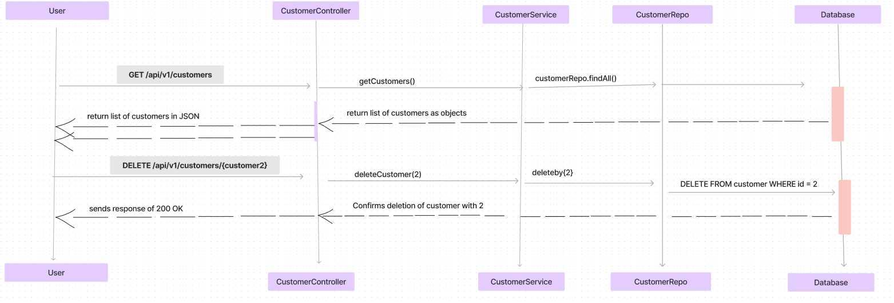

# How to run
Run ```docker run -p 5432:5432 -e POSTGRES_PASSWORD=password -e POSTGRES_USER=user postgres``` before starting
the main Spring Boot application. You can start it using the run button on IntelliJ or in another terminal 
run ``mvn clean package`` then run ``java -jar target/spring-boot-example-0.0.1-SNAPSHOT.jar server application.yml
``
# What is the application?
REST API monolith Spring application that uses a postgres database to store customers. A REST API is exposed to the user. 

### Endpoints

1. **Get all customers**
    - **Request:**
        - Method: GET
        - URL: `/api/v1/customers`
        - Example Request:
          ```
          GET /api/v1/customers
          ```

    - **Response:**
        - Status Code: 200 OK
        - Body: Array of customer objects containing `id`, `name`, `email`, and `age` fields.

2. **Add a new customer**
    - **Request:**
        - Method: POST
        - URL: `/api/v1/customers`
        - Example Request:
          ```
          POST /api/v1/customers
          Content-Type: application/json
   
          {
            "name": "John Doe",
            "email": "john@example.com",
            "age": 30
          }
          ```

    - **Response:**
        - Status Code: 201 Created
        - Body: New Customer object containing `id`, `name`, `email`, and `age` fields.

3. **Delete a customer**
    - **Request:**
        - Method: DELETE
        - URL: `/api/v1/customers/{customerId}`
        - Example Request:
          ```
          DELETE /api/v1/customers/123
          ```

    - **Response:**
        - Status Code: 200 OK
        - Body: Success message confirming deletion.

4. **Update a customer**
    - **Request:**
        - Method: PUT
        - URL: `/api/v1/customers/{customerId}`
        - Example Request:
          ```
          PUT /api/v1/customers/123
          Content-Type: application/json
   
          {
            "name": "Updated Name",
            "email": "updated@example.com",
            "age": 35
          }
          ```

    - **Response:**
        - Status Code: 201 Created
        - Body: New Customer object containing `id`, `name`, `email`, and `age` fields.

 These endpoints are defined in the `CustomerController` class.

### How the Test works
- The  integration test spins up the controller, service and database layer. As part of the test it uses the TestContainers 
library to set up a Postgres container.
- The ``CustomerControllerTest.Initializer`` static class overrides the application properties in ``application.yml`` so that our 
application points to the Postgres container
- Next liquibase runs the database migrations defined in the `migrations.xml` file to set up the customer table in the PostgreSQL container so that the container has a Customer table.
- After, JDBI connects to our Postgres container to add test data into our Postgres container (e.g. adding and removing customers from our table) for our tests to work. 
An @AfterEach hook runs after each test to clear away the test data.
- Jackson is used for JSON serialisation and deserialisation, For example it uses NewCustomerRequest to deserialize the body of the POST request and uses List to serialize to JSON. Hibernate is the JPA implementation and is an ORM which uses 
 `@entity` to map onto the Customer table in the database
- The CustomerRepo interface extends JpaRepository<Customer, Integer>, which provides some built-in methods for database operations (e.g., save(), findById() etc) which are available to us without explicitly defining them
- `@Autowired` annotation is used to inject dependencies into Spring-managed beans
- In our `CustomerController`, it uses `@Autowired` to o inject an instance of `CustomerService` into its `customerService` field
 which allows `CustomerController`  to use the methods of `CustomerService` without manually creating an instance.
- Rest Assured is used in the test to verify the correct behavior of the API endpoints by sending requests and checking responses against expected values.

###  How the Application works
- The application uses SpringDoc OpenAPI to generate Swagger documentation. The `CustomerApplication` class is annotated with @OpenAPIDefinition to provide metadata for the API documentation e.g titles etc.
 In the `CustomerController` class the `@RestController` and `@RequestMapping` annotations define the base URL for the endpoints. The `@Tag `annotation provides a description for the API documentation.
- The SwaggerUI is configured in the `application.yml` file with path to access it. It can be accessed at http://localhost:9000/swagger-ui.html
when the application is running.
The application.yml file contains the app's configuration details, like Liquibase config for database.
- Liquibase reads and applies database migrations defined in `00001_create_table_customer.sql` and creates the customer table
- This file contains SQL commands to create the customer table, including columns for `id`, `name`, `email`, and `age`

 ### Database schema 
-` CREATE TABLE customer (
  id SERIAL PRIMARY KEY,
  name VARCHAR(50),
  email VARCHAR(100),
  age INTEGER
  );`

#### Error handling:
There is a `CustomerNotFoundException.class` that throws an error with a descriptive message for when customer is not found

### Sequence diagram



